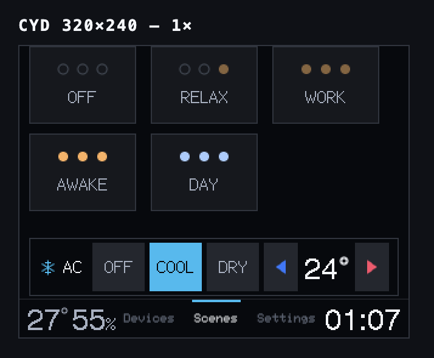

# cyd-ha — Home Assistant bedroom controller

Firmware turning a CYD "Cheap Yellow Display" (ESP32-2432S028R) into a one-tap
wall/nightstand controller for four bedroom devices. No phone, no app, no
drill-down — every action is a single tap on a fixed 320×240 screen, and the screen
doubles as a status display.

<p align="center">
  
  <br>
  <sub>The Scenes page, rendered by <code>simulator.html</code> from the panel's real glyphs.</sub>
</p>

Three pages, switched from the tab bar along the bottom edge. That is the whole
navigation model: no drill-down, no fourth page, and scrolling only on Scenes.
Leave the panel alone for 5 minutes on Devices or Settings and it goes back to
Scenes by itself, so walking up to it always lands on the scene grid.

**Devices** — the four entities, 23 controls, one card each.

```
┌────────────────────────────────────────────────┐
│ ┌────────────────────────────────────────────┐ │
│ │ ◐ 1  [ OFF ][ 1% ][ 30% ][ 100% ]   ◉   ○  │ │
│ └────────────────────────────────────────────┘ │
│ ┌────────────────────────────────────────────┐ │
│ │ ○ 2  [ OFF ][ 1% ][ 30% ][ 100% ]   ◉   ○  │ │
│ └────────────────────────────────────────────┘ │
│ ┌────────────────────────────────────────────┐ │
│ │ ● 3  [ OFF ][ 1% ][ 30% ][ 100% ]   ◉   ◉  │ │
│ └────────────────────────────────────────────┘ │
│ ┌────────────────────────────────────────────┐ │
│ │ ❄ AC [ OFF ][ COOL ][ DRY ]  [◀]  24°  [▶] │ │
│ └────────────────────────────────────────────┘ │
├────────────────────────────────────────────────┤
│ 27°55%    ‾‾‾‾‾‾‾                              │
│           Devices   Scenes   Settings    23:00 │
└────────────────────────────────────────────────┘
```

Every card is a single line — icon, name, then every control at the card's full
height. The bottom bar carries the AC's live **room temperature and humidity** on
the left, the tabs in the middle (the current one marked by a cyan bar above its
label), and the clock on the right, so both readings are visible from every page.

The icon at the left of each card is the fastest thing to read on the page, and it
is derived from live state rather than being a label: a bulb is a filled glyph in
its **actual colour temperature, dimmed by its actual brightness**, or a hollow
outline when off. So the icon column tells you what the room is doing before you
read a word. The AC shows a snowflake, a droplet or a power symbol to match its
mode.

On a bulb card that icon is the *only* readout — there is no room on the line for
a number, and the chips are only presets, so a bulb set to 47% from the phone
lights no chip and shows no percentage. Its colour and dimness still tell you what
it is doing. A selected brightness chip fills yellow; everything else selected
fills cyan. The two circles are the colour-temperature ends (the bulbs are
white-spectrum, so the control *is* its colour).

The AC's setpoint sits between the two chevrons that change it — blue down on the
left, red up on the right — and the dead cell between them is deliberate: it
stops a slightly-off tap from stepping the wrong way. The chevrons do nothing
until the first AC poll lands, since they step relative to a setpoint that has to
be known first.

An unreachable device is unmistakable: the whole card outlines in red, icon and
name with it, and every control greys out, because there is no current state to
highlight.

**Scenes** — macros over the three bulbs (no scene touches the AC), in a
3-column grid, with the **AC card copied down from the Devices page** pinned
below it so the one device a scene deliberately cannot reach is still one tap
away. Five scenes are defined; six fit on screen, and past that the page scrolls
a page at a time from the gutter on the right.

```
┌────────────────────────────────────────────────┐
│ ┌──────────┐ ┌──────────┐ ┌──────────┐       ▲ │
│ │  ○ ○ ○   │ │  ○ ○ ●   │ │  ● ● ●   │       ▪ │
│ │   OFF    │ │  RELAX   │ │   WORK   │       ▪ │
│ └──────────┘ └──────────┘ └──────────┘       ▪ │
│ ┌──────────┐ ┌──────────┐                    ▪ │
│ │  ● ● ●   │ │  ● ● ●   │                    ▪ │
│ │  AWAKE   │ │   DAY    │                    ▼ │
│ └──────────┘ └──────────┘                      │
│                                                │
│ ┌────────────────────────────────────────────┐ │
│ │ ❄ AC [ OFF ][ COOL ][ DRY ]  [◀]  24°  [▶] │ │
│ └────────────────────────────────────────────┘ │
├────────────────────────────────────────────────┤
│ 27°55%              ‾‾‾‾‾‾                     │
│           Devices   Scenes   Settings    23:00 │
└────────────────────────────────────────────────┘
```

That card is not a scene and takes no part in one: it is the Devices page's AC
card, drawn a second time at the identical rect, with the same chips, the same
stepper, the same press flash and the same red border on a failed call. Tapping
it on this page does exactly what tapping it on Devices does.

The blank band between the last tile row and the card is deliberate — the tiles
were kept at their original size rather than grown into it, so the two visible
rows sit exactly where the first two always did.

The three pips on a tile are one per bulb, read straight off the scene's own
definition: a ring means that bulb will be off, a filled pip means on — amber for
2202 K, blue for 4000 K, and dimmer for a lower level. They replaced the text
captions the older full-width cards carried, which no longer fit and which could
drift from what the tap actually sends.

The grid is three columns rather than four so the name fits at full size; legible
tiles beat a denser grid of cramped ones, and the page still scales past a
hundred.

The arrows and thumb only appear once the scene table outgrows one screen — from
the seventh scene on — so with five the gutter is a plain margin and ignores
taps. Adding a scene is one line in `SCENE[]` in `src/ui/screen_scenes.cpp` —
there is no count to update anywhere else, and the renderer's memory does not
grow with the list.

A scene highlights when the bulbs *actually match* it, rather than when you last
tapped it. So overriding one bulb on the Devices page deselects it, and a change
made from the HA app selects the matching one — there is no stored "current
scene" to drift out of sync. Applying one is a single `light.turn_on` for all
three bulbs (two calls for RELAX), not six.

**Settings** — the board's own knobs, persisted to NVS. Nothing here touches Home
Assistant.

```
┌────────────────────────────────────────────────┐
│ ┌────────────────────────────────────────────┐ │
│ │ ☀ Brightness                           50% │ │
│ │ [ 1% ][ 25% ][ 50% ][ 75% ][ 100% ]        │ │
│ └────────────────────────────────────────────┘ │
│ ┌────────────────────────────────────────────┐ │
│ │ ☾ Night mode                               │ │
│ │ [ OFF ][ SHIFT ][ RED ]                    │ │
│ └────────────────────────────────────────────┘ │
│ ┌────────────────────────────────────────────┐ │
│ │ 🔉 Volume                              60% │ │
│ │ [0%][20%][40%][60%][80%][100%]             │ │
│ └────────────────────────────────────────────┘ │
│ ┌─────────────────────┐ ┌────────────────────┐ │
│ │ ◷ Schedule  (══●)   │ │ ↻ Flip     (●══)   │ │
│ └─────────────────────┘ └────────────────────┘ │
├────────────────────────────────────────────────┤
│ 27°55%                        ‾‾‾‾‾‾‾‾         │
│           Devices   Scenes   Settings    23:00 │
└────────────────────────────────────────────────┘
```

**Night mode** has two strengths. **Red** turns the entire UI red-only and drops
the backlight to 1%. **Shift** is milder: a warm, amber-tinted palette with green
and blue turned down, at whatever brightness you picked. **Schedule** switches Red
on at 23:45 and off at 08:00. It *writes* the picker at those two moments rather
than overriding it, so in between, picking by hand always works and sticks until
the next boundary. Shift is manual only; the schedule never selects it. A reboot
inside the window comes up already in Red.

**Volume** sets the loudness of the tap sound and the boot chime, from 0% (mute)
to 100%. The steps are spaced 5 dB apart rather than evenly, because loudness is
heard logarithmically. Tapping a Volume chip plays the sound at the new level, so
you hear what you picked.

**Flip** rotates the display 180°, for mounting the board upside down; taps are
mirrored to match.

### Sound

Every accepted tap plays a short wooden "tock" through the board's speaker
connector, synthesised sample by sample into the ESP32's DAC. A tap that hits no
control stays silent, so silence means nothing happened.

On power-on the board plays a soft **boot chime** with the splash logo: one warm
F♯-major chord that swells in and dissolves over 1.6 s, in the spirit of the macOS
startup sound. It follows the Volume setting and plays only on a real power-on or
reset-button press. The 05:30 daily restart, crashes and power dips boot silently,
so it won't wake anyone.

### Status

All four devices refresh together every 1.5 s via a single templated request, so
a change made from the HA app shows up here in about a second (measured
1009–1036 ms).

The bottom-right shows a 24-hour clock in **Asia/Bangkok**, set over NTP —
keyless, no API account, and the ESP32's SNTP client resyncs itself with no
polling code. It reads `--:--` for the second or two before the first sync lands.
Change the zone via `TZ_INFO` in `include/config.h`; the POSIX sign is inverted,
so `"ICT-7"` means UTC**+**7.

Connection health shows up only when there is nothing good to report: if Home
Assistant becomes unreachable, a red **No Connection** banner takes over the top
row on whichever page you are on, and while everything is working it costs no
pixels at all. It does not distinguish "Wi-Fi is down" from "Home Assistant is
not answering" — either way nothing you tap will reach the house, and the serial
log has the detail if you want it. It is a word rather than a colour, so it
survives Red night mode. Individual cards dim when their own data goes stale, and
a card whose last command *failed* flashes a red border.

The board restarts itself once a day at 05:30, inside the night window, so slow
memory drift never builds up on a panel that runs 24/7.

### Look

The currently-active state is filled in Home Assistant cyan, and it is the only
saturated colour on a resting screen — if everything is highlighted, nothing is.
The deliberate exceptions are each scoped to one control: a bulb's selected
brightness chip is yellow, and the AC's chevrons are blue (down) and red (up). On
a lit bulb a brightness chip *and* a colour swatch can both be active; they are
independent axes, not one choice.

The interface is built on a small design system rather than per-screen styling: 19
semantic colour tokens and four type roles (`src/ui/theme.h`, `src/ui/gfx.h`), one
spacing scale and square corners throughout (the LAYOUT block of
`include/config.h`), and a component library every control is built from
(`src/ui/widgets.cpp`). Text uses TFT_eSPI's built-in bitmap fonts, drawn pixel for
pixel at one fixed size, so every stroke lands on the panel's grid with nothing
scaled. The large numbers (setpoint, room reading, clock) are the one larger size.

## Setup

**1. Fill in secrets.** `include/secrets.h` is gitignored; a template is committed.

```sh
cp include/secrets.h.example include/secrets.h
$EDITOR include/secrets.h
```

You need a **long-lived access token** from
`http://192.168.1.117:8123/profile/security` → "Long-lived access tokens", plus
the four entity IDs. List the candidates with:

```sh
TOKEN='paste-token'
curl -s -H "Authorization: Bearer $TOKEN" http://192.168.1.117:8123/api/states \
  | python3 -c 'import json,sys; [print(e["entity_id"], "|", e["attributes"].get("friendly_name","")) for e in json.load(sys.stdin) if e["entity_id"].startswith(("light.","climate."))]'
```

**2. Verify the assumptions** before flashing — a mismatch here changes the
button map, and it is much easier to debug over curl than over serial:

```sh
# Bulbs: confirm color_temp is supported and check the real kelvin range
curl -s -H "Authorization: Bearer $TOKEN" \
  http://192.168.1.117:8123/api/states/light.YOUR_BULB \
  | python3 -m json.tool | grep -i -A4 'color_modes\|kelvin'

# AC: confirm "cool" and "dry" exist, and read the step / limits
curl -s -H "Authorization: Bearer $TOKEN" \
  http://192.168.1.117:8123/api/states/climate.YOUR_AC \
  | python3 -m json.tool | grep -i 'hvac_modes\|min_temp\|max_temp\|target_temp_step'
```

If `min_color_temp_kelvin`/`max_color_temp_kelvin` differ from 2200/4000, update
`KELVIN_WARM`/`KELVIN_COOL` in `include/config.h`.

**3. Build and flash.** With the CYD on USB:

```sh
pio run                # compile only
pio run -t upload      # build + flash
pio device monitor      # serial log @ 115200
```

Keep `upload_speed = 115200`. Anything faster caused serial corruption while
flashing this board.

**4. Wi-Fi.** Leave `WIFI_SSID`/`WIFI_PASS` empty in `secrets.h` and the device
opens a captive portal on first boot — join it from a phone and enter
credentials. Or hardcode them in `secrets.h` to skip the portal.

> ### ⚠ If the screen shows only the Home Assistant logo and never reaches the controls
>
> It is waiting for Wi-Fi setup. **Join the hotspot `CYD-HA-Setup` from a phone**
> and enter your credentials.
>
> The boot splash is deliberately logo-only with no text, so **nothing on screen
> tells you this** — the portal state and the normal connecting state look
> identical. This README and the serial log (`pio device monitor`) are the only
> places the hotspot name appears. The three pips under the logo cycle while the
> device is working, so a live board is at least distinguishable from a hung one.
> The portal times out after 180 s, after which the device reboots and tries again.

## simulator.html

The fast iteration path for layout work. It re-implements the exact geometry from
`include/config.h` in canvas — all three pages, the tab bar, the night palette and
the flipped tap mapping — flags any clipping or overflow, and its click handling
mirrors `screenHitTest()` (including the AC row's reversed stepper slots). It also
re-checks every `static_assert` from `screen.cpp` and asserts the night palette
keeps every semantically-paired colour apart.

Crucially it draws the **panel's actual glyphs**: the byte streams from TFT_eSPI's
built-in fonts are embedded and decoded the same way `drawChar` does, so what you
see is pixel-for-pixel what the panel shows, and its width measurements are
byte-identical to the device's. That is what makes a "this label will clip"
warning worth acting on.

```sh
python3 -m http.server 8765     # then open http://localhost:8765/simulator.html
```

Any state can be deep-linked, which is how a specific case gets reproduced or
screenshotted — `?page=1&night=1&scenes=100&stale=1&ha=0&mode=heat&avail=0`, or
`?room=-10&hum=100` for an out-of-range room reading; the full list is at the
bottom of the file. The buttons in the side panel cover the
same ground interactively, including growing the scene table to 24 or 100 entries
to exercise the scroll path that is dead code at five.

Keep its constants in sync with `config.h` — that is the whole point of it.

## Host check

`tools/host_check/` compiles the UI's logic (hit testing, button geometry, scene
matching, the dirty-region early-outs) as an ordinary program on the Mac, against
stub hardware headers, and diffs its output against a committed golden file. It
catches logic regressions that the simulator, which mirrors geometry rather than
the C++, cannot.

```sh
tools/host_check/build.sh --diff     # after any change under src/ui/
tools/host_check/build.sh --golden   # only when a change is intended — say so in the commit
```

## Troubleshooting

| Symptom | Fix |
|---|---|
| White screen on boot | You have the dual-USB CYD variant — swap `ILI9341_2_DRIVER` for `ST7789_DRIVER` in `platformio.ini` |
| Whites look cyan, oranges look green | Remove `-D TFT_RGB_ORDER=TFT_BGR` (your panel doesn't swap R/B) |
| Colours inverted | Add `-D TFT_INVERSION_ON=1` |
| **Taps land on the wrong button** | Run the calibration below. Check `TOUCH_SWAP_XY` **first** — on this unit that flag, not the ranges, was the cause. Wrong swap collapses every tap into the left third of the screen, so only buttons 0-2 respond and the AC row is unreachable |
| Taps never register at all | `TOUCH_Z_MIN` too high, or `TOUCH_REQUIRE_IRQ` is 1 on a board whose PENIRQ sticks high — set it to 0 and retest |
| Phantom taps change lights by themselves | `TOUCH_Z_MIN` is inside the noise band. Read the `touch idle: rawZ=..` serial lines for the real noise floor and set the threshold well above it (this unit: noise ~50-130, real contact ~2100-2500) |
| **High-pitched whine at every brightness step except 100%** | Backlight PWM inside the audible band. `BL_PWM_HZ` (`config.h`) must stay above ~20 kHz; it is 25 kHz. 100% is silent even at a bad frequency because `ledcWrite()` promotes duty 255 to a constant DC high, so that step is the tell, not an exception. A whine that persists at 100% too, or during flashing, is not the backlight |
| Backlight won't dim | The Settings brightness only works if LEDC is configured **after** `screenBegin()` — `TFT_eSPI::init()` reclaims `TFT_BL` as a plain output |
| Screen flipped but taps land 180° out | The flip mirrors the *tap*, not the digitiser — check the `if (S.set.flip)` mirror in `handleTouch()`. Never "fix" this by recalibrating while flipped; `CALIB_MODE` forces flip off for that reason |
| Stuck in night mode, screen barely visible | Red night mode is 1% backlight by design. The Settings tab is still there — tap it and pick Night mode **OFF**. Turn off Schedule too, or 23:45 will switch Red back on |
| Tapping the right edge of Scenes does nothing | Expected while every scene fits on one screen — the scroll gutter is drawn empty and ignores taps until the table needs a second page |
| Two scene tiles lit at once | Shouldn't happen: an unknown colour temp counts as "cannot confirm", not a match. If it does, a bulb is reporting `kelvin <= 0` while `supportsCT` is true |
| Tab taps miss but card controls are fine | The tab bar sits below `CAL_INSET`, so the 4-point fit extrapolates there. Re-run `-e calib` and check the tab outlines on the verify screen |
| **No Connection** banner | Wi-Fi down, token wrong/expired, or `HA_HOST` unreachable — check for `ha: POST /api/template -> 401` on serial |
| A bulb's colour swatches are greyed out | The bulb doesn't report `color_temp` support — it's a plain dimmable-white TRADFRI, not white-spectrum |
| A card has a steady red border, red name, greyed controls | HA itself can't reach that device (Zigbee dropout). Deliberate — there is no current state to highlight |
| AC chevrons do nothing | Expected until the first successful AC poll lands; they step relative to the current setpoint, and the readout shows `--` until then |
| The room reading turns small | A reading too wide for the large digits (`-10`, `100%`) drops to the smaller font rather than spill into the tabs. It means the sensor is reporting something unusual |
| No boot chime | It plays only on a real power-on or reset-button press, never after the 05:30 restart or a crash (serial: `chime: skipped, reset reason N`). Also silent at Volume 0% |
| Crackle or hum from the speaker when idle | The speaker pin must idle as a GPIO driven LOW with the DAC off (`speakerIdle()`). Anything holding the DAC at a level between sounds feeds supply noise into the amp |
| The page jumps to Scenes on its own | Expected after 5 minutes without a touch on Devices or Settings (`IDLE_HOME_MS` in `config.h`) |

## Touch calibration

The touch mapping is measured, not guessed. To redo it:

```sh
pio run -e calib -t upload     # then tap the 4 crosshairs on screen
pio device monitor             # reads back a ready-to-paste TOUCH_* block
```

Tap the centre of each crosshair (top-left, top-right, bottom-right,
bottom-left). The firmware fits the four points, prints the constants, and then
shows a **verify** screen drawing the real button grid — tap boxes and confirm
the dot lands inside before committing to the values. Paste the printed block
into `include/config.h`, then reflash the normal firmware with `pio run -t upload`.

> `env:calib` has **no Wi-Fi and no Home Assistant** — it cannot touch your
> lights, so tap freely. But the device is inert as a controller until you flash
> `env:cyd` again.

Current values were verified across all 23 buttons with sub-pixel residuals.

## Roadmap

- **WebSocket API** (`subscribe_entities`) instead of polling — would cut
  external-change latency from ~1 s to instant.
- **LDR auto-dim** on GPIO34 for night use (calibration constants already exist
  in the sibling `btcticker-cyd` project).
- **Burn-in pixel-shift** if left on 24/7.
